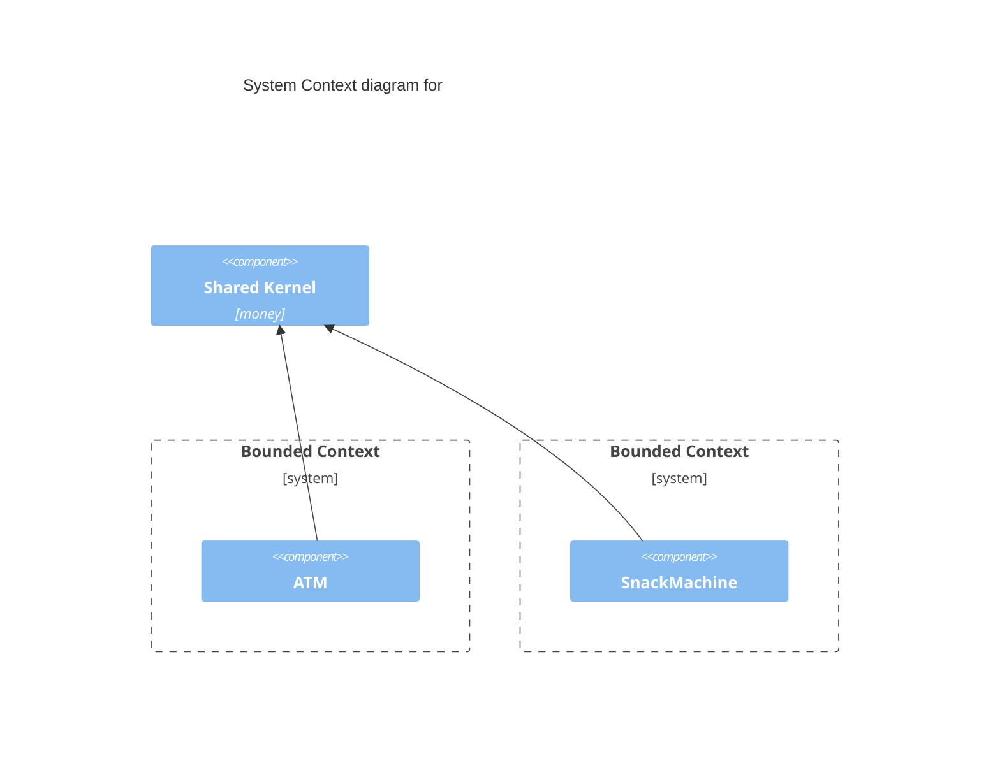

#### Aggregates

A root aggregate is a collection of entities which have a life-cycle dependency. If an entity cannot exist without another then it is a part of root aggregate. On the other hand if an entity can live on its own then it probably is another root or value object.

Entities inside comprise a cohesive group of classes.

As the domain evolves and new knowledge is gained don't hesitate to change the boundaries.

Beaware of creating too large aggregates this makes it harder to maintain consistency when dealing with multiple transactions.

Most aggregates consist of 1 or 2 entities. Usually 3 entities per aggregate is the max. Whereas the number of ValueObjects per aggregate has no such limit.

[cohesion and boundaries](http://bit.ly/1lisDBQ)

#### Repositories

Is a pattern encapsulating all database communication.

For a domain model there should be a repository for each aggrate. And a repository should work with aggregate roots only.

#### Bounded Contexts

* Separaration of the model into smaller ones.
* Boundary for the ubiquitous language.
* Span across all layers in the onion architecture.
* Explicit relationships between different bounded contexts.

